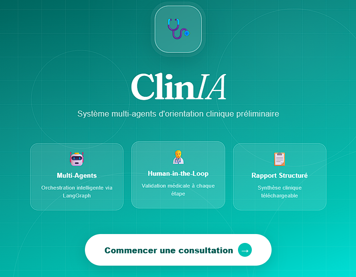
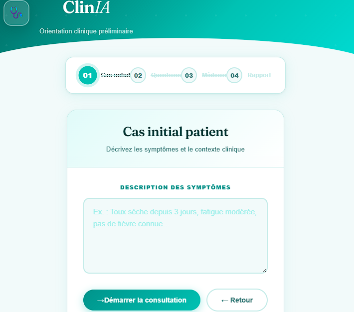
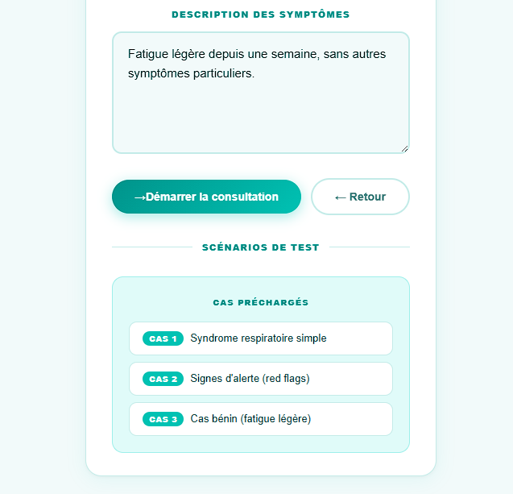
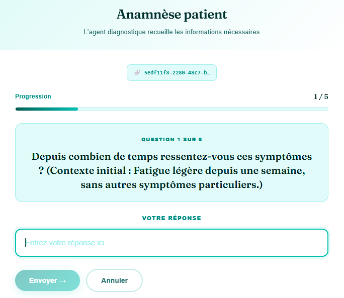
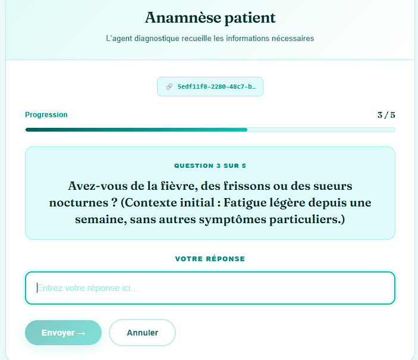
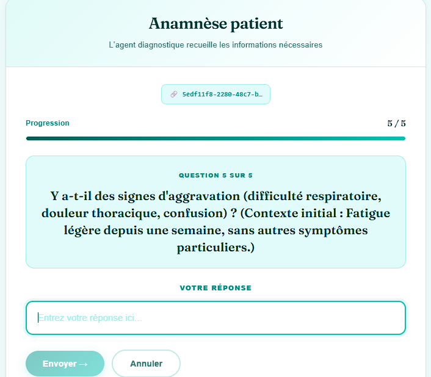
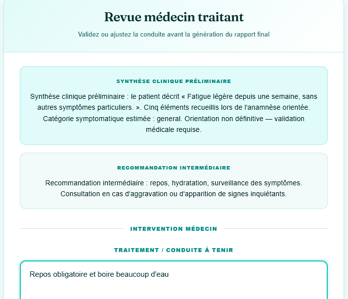
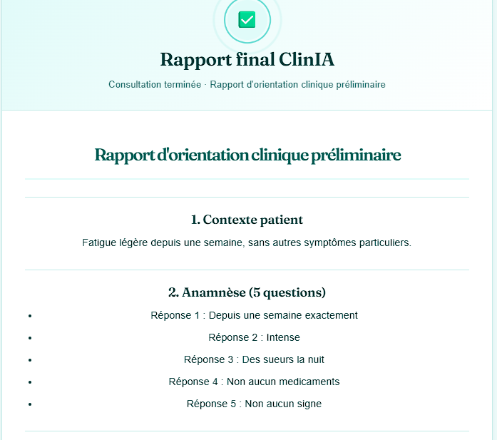
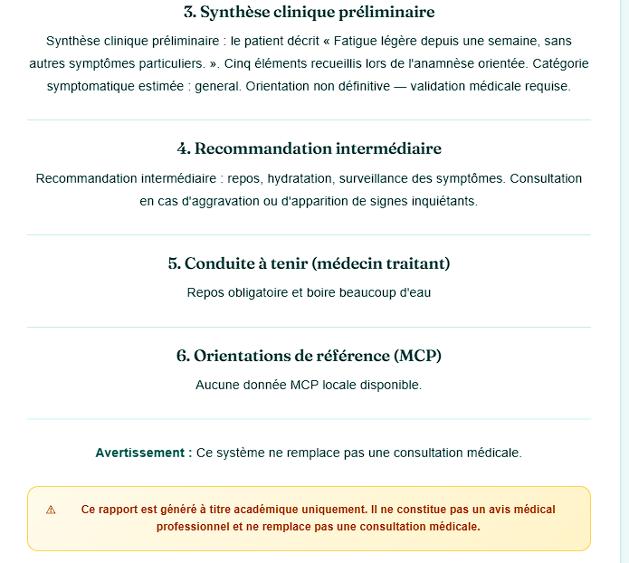
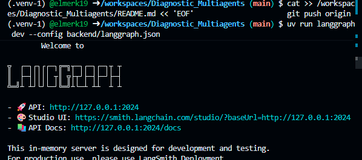

# 🩺 ClinIA — Système Multi-Agents d'Orientation Clinique Préliminaire
> Exercice académique — ne remplace pas une consultation médicale professionnelle.

## Description
ClinIA est un prototype académique de système d'orientation clinique préliminaire basé sur une architecture multi-agents LangGraph. Il simule un workflow médical complet : recueil des informations patient, synthèse clinique préliminaire, validation humaine par un médecin traitant, et génération d'un rapport final structuré.

## Architecture globale
┌─────────────────────────────────────────────────────────┐
│                        ClinIA                           │
├──────────────┬──────────────────┬───────────────────────┤
│   Frontend   │     Backend      │      MCP Server       │
│  React/Vite  │  FastAPI +       │  Guidelines cliniques │
│  Port 5173   │  LangGraph       │  (stdio)              │
│              │  Port 8000       │                       │
└──────────────┴──────────────────┴───────────────────────┘
## Structure du projet
Diagnostic_Multiagents/
├── backend/
│   ├── app/
│   │   ├── api.py              → endpoints REST FastAPI
│   │   ├── graph.py            → workflow LangGraph
│   │   ├── state.py            → état partagé MedicalState
│   │   ├── llm.py              → configuration LLM
│   │   ├── nodes/
│   │   │   ├── supervisor.py         → orchestrateur
│   │   │   ├── diagnostic_agent.py   → agent diagnostique
│   │   │   ├── physician_review.py   → Human-in-the-Loop
│   │   │   └── report_agent.py       → générateur de rapport
│   │   └── tools/
│   │       ├── patient_tools.py      → questions patient
│   │       ├── care_tools.py         → recommandations
│   │       └── mcp_client.py         → client MCP
│   └── langgraph.json          → config LangGraph Studio
├── mcp_server/
│   ├── server.py               → serveur MCP
│   └── data/
│       └── guidelines.json     → orientations cliniques
├── frontend/
│   └── src/
│       └── App.jsx             → interface React ClinIA
├── docs/
│   └── screenshots/            → captures d'écran
├── .env.example
├── pyproject.toml
├── rapport_technique.md
└── README.md
## Workflow LangGraph
START → Supervisor → DiagnosticAgent (×5 questions patient)
→ recommend_interim_care
→ fetch_clinical_guidelines (MCP)
→ Supervisor → PhysicianReview (Human-in-the-Loop)
→ Supervisor → ReportAgent
→ Supervisor → END
## Agents

| Agent | Rôle |
|-------|------|
| Supervisor | Orchestre le workflow et décide du prochain nœud |
| Diagnostic Agent | Pose 5 questions, détecte les red flags, produit une synthèse |
| Physician Review | Human-in-the-Loop — validation médicale obligatoire |
| Report Agent | Génère le rapport final structuré en Markdown |

## Tools

| Tool | Description |
|------|-------------|
| `ask_patient` | Formule et pose une question au patient |
| `recommend_interim_care` | Génère une recommandation prudente |
| `fetch_clinical_guidelines` | Récupère les orientations via MCP |

## Prérequis
- Python 3.11+
- Node.js 18+
- `uv`
- Une clé OpenAI (optionnelle — mode fallback disponible)

## Installation

### 1. Cloner le projet
```bash
git clone https://github.com/elmerk19/Diagnostic_Multiagents.git
cd Diagnostic_Multiagents
```

### 2. Configuration
```bash
cp .env.example .env
# Renseignez OPENAI_API_KEY dans .env (optionnel)
```

### 3. Backend
```bash
uv sync
uv run python -m uvicorn backend.app.api:app --reload --port 8000
```

### 4. Frontend
```bash
cd frontend
npm install
npm run dev -- --host
```

### 5. LangGraph Studio
```bash
uv run langgraph dev --config backend/langgraph.json
# Ouvrir : https://smith.langchain.com/studio/?baseUrl=http://127.0.0.1:2024
```

## Endpoints API

| Méthode | Endpoint | Description |
|---------|----------|-------------|
| POST | `/sessions/start` | Créer une session |
| POST | `/consultation/start` | Démarrer une consultation |
| POST | `/consultation/resume` | Reprendre (réponse patient ou médecin) |
| GET | `/consultation/{thread_id}` | État de la consultation |
| GET | `/consultation/{thread_id}/report` | Rapport final |
| GET | `/health` | Santé de l'API |

### Exemples curl
```bash
# Démarrer une consultation
curl -X POST http://localhost:8000/consultation/start \
  -H "Content-Type: application/json" \
  -d '{"initial_case": "Toux sèche depuis 3 jours, fatigue modérée."}'

# Répondre à une question
curl -X POST http://localhost:8000/consultation/resume \
  -H "Content-Type: application/json" \
  -d '{"thread_id": "ID_SESSION", "patient_answer": "Depuis 3 jours."}'

# Validation médecin
curl -X POST http://localhost:8000/consultation/resume \
  -H "Content-Type: application/json" \
  -d '{"thread_id": "ID_SESSION", "physician_treatment": "Repos et hydratation."}'
```

## Jeux de tests

| Cas | Description | Red flags |
|-----|-------------|-----------|
| Cas 1 | Toux sèche depuis 3 jours, fatigue modérée | Non |
| Cas 2 | Essoufflement soudain, douleur thoracique | Oui |
| Cas 3 | Fatigue légère depuis une semaine | Non |

Pour chaque cas : 5 questions posées → recommandation intermédiaire → revue médecin → rapport final.

## Intégration MCP
Le serveur MCP expose l'outil `get_clinical_guidelines` qui retourne les orientations cliniques et red flags selon la catégorie symptomatique (respiratory, general). Le client MCP tente d'abord une connexion stdio, puis utilise un fallback local.

## Mode fallback
Sans clé OpenAI, le système génère des synthèses et rapports de façon déterministe — utile pour les tests et démonstrations.

## Limites
- Prototype académique uniquement.
- Ne remplace pas un avis médical professionnel.
- Persistance en mémoire (non persistée entre redémarrages).

## Licence
Projet libre pour usage éducatif.

---

## Aperçu de l'application

### Page d'accueil


### Écran 1 — Cas initial



### Écran 2 — Questions patient




### Écran 3 — Revue médecin


### Écran 4 — Rapport final



### LangGraph Studio

